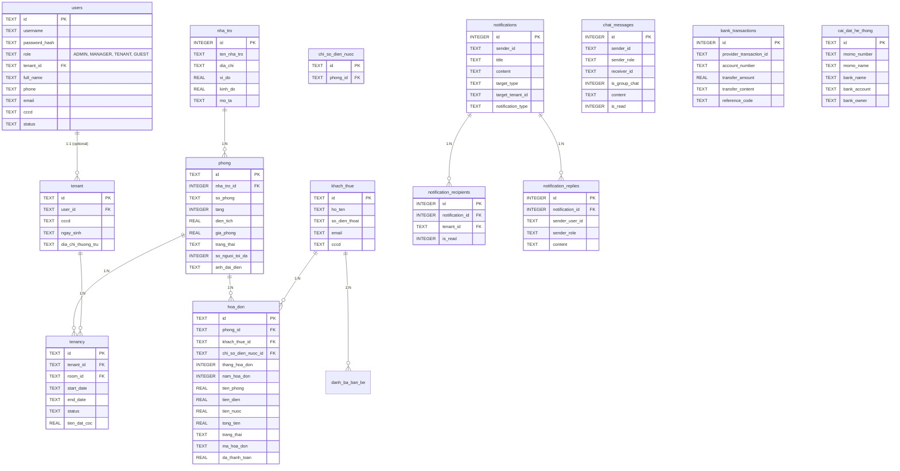

# Sơ đồ Thực thể Liên kết (ERD) - HostelMate

Dưới đây là sơ đồ cấu trúc cơ sở dữ liệu của hệ thống HostelMate. Sơ đồ này mô tả các thực thể chính và mối quan hệ giữa chúng.

```mermaid
erDiagram
    users ||--o{ tenant : "1:1 (optional)"
    users {
        TEXT id PK
        TEXT username
        TEXT password_hash
        TEXT role "ADMIN, MANAGER, TENANT, GUEST"
        TEXT tenant_id FK
        TEXT full_name
        TEXT phone
        TEXT email
        TEXT cccd
        TEXT status
    }

    nha_tro ||--o{ phong : "1:N"
    nha_tro {
        INTEGER id PK
        TEXT ten_nha_tro
        TEXT dia_chi
        REAL vi_do
        REAL kinh_do
        TEXT mo_ta
    }

    phong ||--o{ hoa_don : "1:N"
    phong ||--o{ tenancy : "1:N"
    phong {
        TEXT id PK
        INTEGER nha_tro_id FK
        TEXT so_phong
        INTEGER tang
        REAL dien_tich
        REAL gia_phong
        TEXT trang_thai
        INTEGER so_nguoi_toi_da
        TEXT anh_dai_dien
    }

    khach_thue ||--o{ hoa_don : "1:N"
    khach_thue ||--o{ danh_ba_ban_be : "1:N"
    khach_thue {
        TEXT id PK
        TEXT ho_ten
        TEXT so_dien_thoai
        TEXT email
        TEXT cccd
    }
    
    tenant ||--o{ tenancy : "1:N"
    tenant {
        TEXT id PK
        TEXT user_id FK
        TEXT cccd
        TEXT ngay_sinh
        TEXT dia_chi_thuong_tru
    }

    tenancy {
        TEXT id PK
        TEXT tenant_id FK
        TEXT room_id FK
        TEXT start_date
        TEXT end_date
        TEXT status
        REAL tien_dat_coc
    }

    hoa_don {
        TEXT id PK
        TEXT phong_id FK
        TEXT khach_thue_id FK
        TEXT chi_so_dien_nuoc_id FK
        INTEGER thang_hoa_don
        INTEGER nam_hoa_don
        REAL tien_phong
        REAL tien_dien
        REAL tien_nuoc
        REAL tong_tien
        TEXT trang_thai
        TEXT ma_hoa_don
        REAL da_thanh_toan
    }

    chi_so_dien_nuoc {
        TEXT id PK
        TEXT phong_id FK
    }

    notifications ||--o{ notification_recipients : "1:N"
    notifications ||--o{ notification_replies : "1:N"
    notifications {
        INTEGER id PK
        TEXT sender_id
        TEXT title
        TEXT content
        TEXT target_type
        TEXT target_tenant_id
        TEXT notification_type
    }

    notification_recipients {
        INTEGER id PK
        INTEGER notification_id FK
        TEXT tenant_id FK
        INTEGER is_read
    }

    notification_replies {
        INTEGER id PK
        INTEGER notification_id FK
        TEXT sender_user_id
        TEXT sender_role
        TEXT content
    }

    chat_messages {
        INTEGER id PK
        TEXT sender_id
        TEXT sender_role
        TEXT receiver_id
        INTEGER is_group_chat
        TEXT content
        INTEGER is_read
    }

    bank_transactions {
        INTEGER id PK
        TEXT provider_transaction_id
        TEXT account_number
        REAL transfer_amount
        TEXT transfer_content
        TEXT reference_code
    }
    
    cai_dat_he_thong {
        TEXT id PK
        TEXT momo_number
        TEXT momo_name
        TEXT bank_name
        TEXT bank_account
        TEXT bank_owner
    }
```
