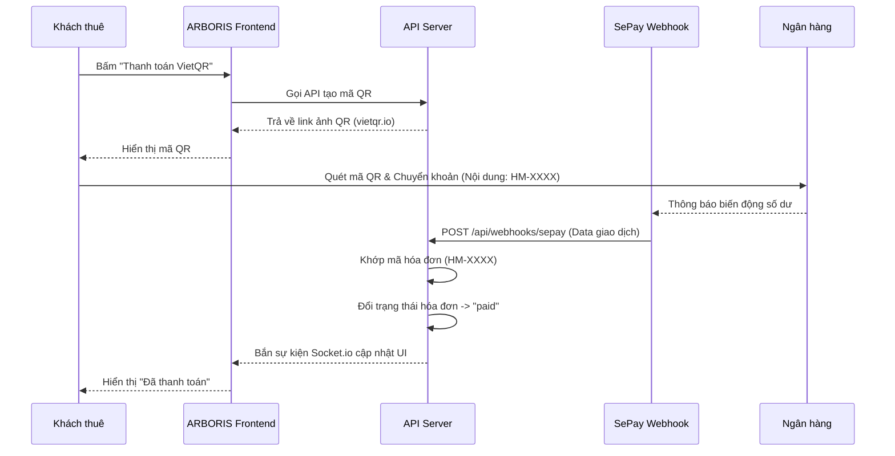

# ARBORIS – Hệ thống quản lý phòng trọ tích hợp

Phiên bản này hợp nhất hai dự án thành **một ứng dụng, một API và một database SQLite**:

- **Admin:** giao diện và quy trình quản lý lấy từ dự án `Quan Li Phong Tro`.
- **Khách thuê:** giao diện và chức năng lấy từ dự án `Group7_ARBORIS`.
- Mục **“chữa lành”** đã được sửa thành **“Sửa chữa”**.
- Dữ liệu Admin và khách thuê được đồng bộ trong cùng file `server/hostelmate.sqlite`.

## 1. Tài khoản mặc định

| Vai trò | Tên đăng nhập | Mật khẩu |
|---|---|---|
| Admin | `admin` | `123456` |

Database bàn giao được khởi tạo sạch: chưa có phòng, người thuê, hợp đồng, điện nước, hóa đơn, yêu cầu sửa chữa hay giao dịch.

## 2. Khởi động nhanh trên Windows

Chạy file:

```text
START_ARBORIS.bat
```

Sau đó mở:

```text
http://localhost:5173
```

Lần đầu chạy, file `.bat` tự cài thư viện nếu chưa có `node_modules`.

### Chạy bằng lệnh

```bash
npm install
cd server
npm install
cd ..
npm run dev:all
```

- Frontend: `http://localhost:5173`
- Backend API: `http://localhost:5000`
- Kiểm tra server: `http://localhost:5000/api/health`

## 3. Quy trình sử dụng chuẩn

1. Đăng nhập Admin bằng `admin / 123456`.
2. Vào **Phòng trọ** để tạo phòng.
3. Vào **Người thuê** để thêm khách thuê và xếp khách vào phòng.
4. Vào **Tài khoản** để sinh tên đăng nhập và mật khẩu cho khách.
5. Nhập chỉ số tại **Điện nước**.
6. Tạo hóa đơn tại **Hóa đơn**.
7. Khách thuê đăng nhập bằng tài khoản vừa được cấp và sử dụng:
   - Tổng quan phòng đang thuê;
   - Xem và thanh toán hóa đơn bằng VietQR;
   - Ký/tải hợp đồng;
   - Gửi và theo dõi yêu cầu **Sửa chữa**;
   - Chatbot Gemini khi đã cấu hình API key.

## 4. Database dùng chung

File database duy nhất:

```text
server/hostelmate.sqlite
```

Dữ liệu được giữ lại sau khi tắt và mở lại hệ thống. Để đưa dự án về trạng thái sạch chỉ còn tài khoản Admin:

```bash
npm run reset-db
```

Hoặc chạy:

```text
RESET_DATABASE.bat
```

Muốn tự động xóa dữ liệu mỗi lần server khởi động, đặt trong `.env`:

```env
RESET_DB_ON_START=true
```

> Không nên bật tùy chọn này khi dùng dữ liệu thật.

## 5. Cấu hình `.env`

Dự án đã có `.env` được cấu hình cho VietQR/SePay theo thông tin bàn giao và `.env.example` dùng làm mẫu. Chỉ điền các dịch vụ còn trống như Gemini hoặc Google Login:

```env
PORT=5000
JWT_SECRET=replace_with_a_long_random_secret
VITE_API_URL=http://localhost:5000/api

GOOGLE_CLIENT_ID=
VITE_GOOGLE_CLIENT_ID=

GEMINI_API_KEY=
GEMINI_MODEL=gemini-3.1-flash-lite

SEPAY_WEBHOOK_API_KEY=your_webhook_secret

BANK_ID=your_bank_bin
BANK_ACCOUNT_NO=your_account_number
BANK_ACCOUNT_NAME="YOUR ACCOUNT NAME"
VIETQR_TEMPLATE=compact2
PAYMENT_PREFIX=HM
SEPAY_ALLOWED_ACCOUNT_NUMBERS=your_account_number
LANDLORD_NAME=Chủ trọ ARBORIS
LANDLORD_PHONE=
```

### VietQR

Ba biến bắt buộc để tạo QR đúng tài khoản nhận tiền:

- `BANK_ID`: mã ngân hàng, ví dụ `970422`.
- `BANK_ACCOUNT_NO`: số tài khoản nhận tiền.
- `BANK_ACCOUNT_NAME`: tên chủ tài khoản.

Nội dung chuyển khoản sử dụng mã hóa đơn có tiền tố `HM` để webhook tìm đúng hóa đơn.

### SePay webhook

Chạy backend và mở tunnel:

```text
START_CLOUDFLARED.bat
```

Sau đó cấu hình URL webhook trên SePay:

```text
https://<ten-mien-cloudflared>/api/webhooks/sepay
```

Có thể dùng đường dẫn tương thích:

```text
https://<ten-mien-cloudflared>/api/payments/webhook
```

Điền cùng giá trị vào `SEPAY_WEBHOOK_API_KEY` nếu webhook SePay của bạn gửi API key. Hệ thống có chống xử lý trùng giao dịch theo mã tham chiếu.

### Gemini chatbot

Điền `GEMINI_API_KEY`. Chatbot chỉ truy vấn và hỗ trợ theo dữ liệu/phạm vi nghiệp vụ của dự án; khi chưa có key, API trả thông báo chưa cấu hình thay vì làm server bị dừng.

## 6. Chức năng đã hợp nhất

### Admin

- Tổng quan thống kê;
- Quản lý phòng và trạng thái phòng;
- Quản lý người thuê;
- Xếp phòng, kết thúc/gia hạn hợp đồng;
- Cấp, reset và thu hồi tài khoản khách thuê;
- Ghi chỉ số điện nước;
- Tạo, sửa, xóa và xác nhận hóa đơn;
- Tự động tiếp nhận yêu cầu sửa chữa do khách thuê gửi;
- Xem chi tiết, phân công người xử lý, phản hồi và cập nhật trạng thái yêu cầu;
- Admin không tự tạo hoặc xóa yêu cầu sửa chữa;

### Khách thuê

- Dashboard theo đúng phòng được Admin xếp;
- Xem các thành viên cùng phòng và thông tin hợp đồng;
- Ký và tải PDF hợp đồng;
- Xem hóa đơn, VietQR và trạng thái thanh toán thời gian thực;
- Gửi yêu cầu sửa chữa;
- Cập nhật hồ sơ và đổi mật khẩu;
- Chatbot Gemini.

## 7. Sơ đồ quy trình (Flow Diagrams)

### Sơ đồ Luồng Thanh toán VietQR & SePay Webhook


## 8. Tài liệu API (API Documentation)

Dưới đây là một số API RESTful cốt lõi của hệ thống. Để gọi các API này (trừ `/api/auth/login`), cần truyền token JWT trong Header: `Authorization: Bearer <token>`.

### Auth
- `POST /api/auth/login`: Đăng nhập (Admin hoặc Khách thuê). Body: `{ username, password }`.

### Phòng trọ (Rooms)
- `GET /api/rooms`: Lấy danh sách toàn bộ phòng và người thuê hiện tại.
- `GET /api/rooms/:id`: Lấy chi tiết phòng và danh sách khách từng thuê.
- `POST /api/rooms`: Tạo phòng mới (Chỉ Admin).

### Khách thuê (Tenants)
- `GET /api/tenants`: Lấy danh sách khách thuê.
- `POST /api/tenants`: Thêm khách thuê mới.
- `PUT /api/tenants/:id`: Cập nhật thông tin khách thuê (Đổi mật khẩu, hồ sơ).

### Hóa đơn (Invoices)
- `GET /api/invoices`: Lấy danh sách hóa đơn (Admin xem tất cả, Tenant xem hóa đơn của mình).
- `POST /api/invoices`: Tạo hóa đơn điện nước/tiền phòng.
- `PUT /api/invoices/:id`: Cập nhật hóa đơn (đổi trạng thái thanh toán).

### Sửa chữa (Repairs)
- `POST /api/repairs`: Khách thuê tạo yêu cầu sửa chữa.
- `PUT /api/repairs/:id/status`: Admin cập nhật trạng thái xử lý sự cố.

## 9. Code Quality & SonarQube

> **Lưu ý dành cho sinh viên:** Hãy thay thế đoạn text dưới đây bằng ảnh chụp màn hình Dashboard của SonarQube (đạt chất lượng Level 2+).
> 
> 

## 10. Kiểm tra mã nguồn & Kiểm thử (Testing)

Dự án đã được thiết lập đầy đủ các công cụ kiểm soát chất lượng (đáp ứng tiêu chuẩn SDLC cơ bản):

1. **Unit Test (Jest + Supertest)**: 
   Kiểm thử tự động cho các luồng xử lý API Backend (Tập trung vào tính năng cốt lõi).
   ```bash
   npm run test:server -- --coverage
   ```
2. **Kiểm tra cú pháp (Linting)**: 
   Sử dụng ESLint để đảm bảo chuẩn code.
   ```bash
   npm run lint
   ```
3. **Kiểm tra TypeScript & Build**:
   ```bash
   npm run verify
   ```

## 11. Tích hợp liên tục (CI)

Dự án đã được tích hợp **GitHub Actions** (`.github/workflows/ci.yml`). 
Mỗi khi có code mới được Push hoặc Pull Request vào nhánh `main` và `develop`, GitHub sẽ tự động:
- Cài đặt thư viện.
- Chạy lệnh kiểm tra Linting.
- Chạy toàn bộ Unit Tests bằng Jest.

## 12. Lưu ý triển khai

- Không đẩy file `.env` chứa key thật lên GitHub.
- Không công khai file SQLite khi có dữ liệu thật.
- Đổi `JWT_SECRET` và mật khẩu Admin trước khi triển khai Internet.
- Cloudflared URL miễn phí thường thay đổi sau mỗi lần chạy; phải cập nhật lại URL webhook trên SePay.
